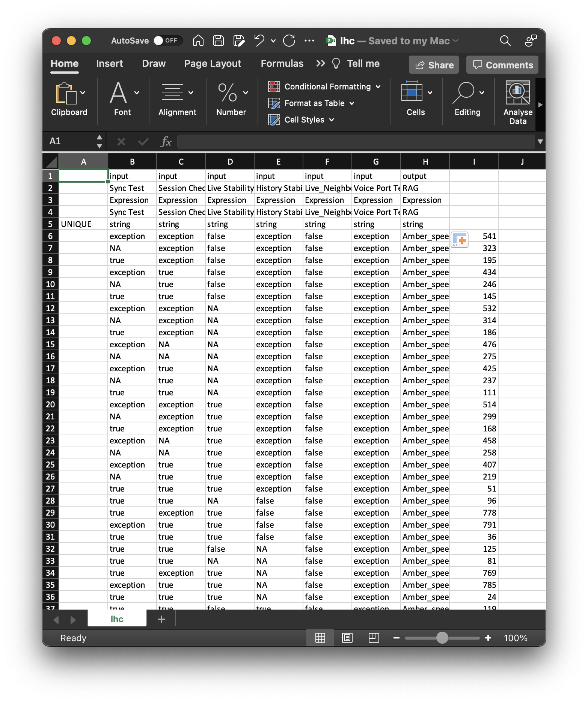
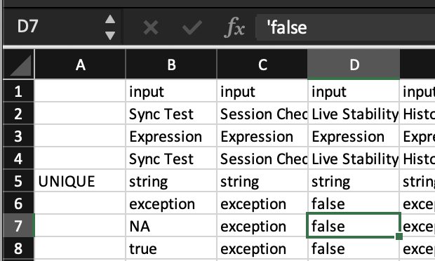
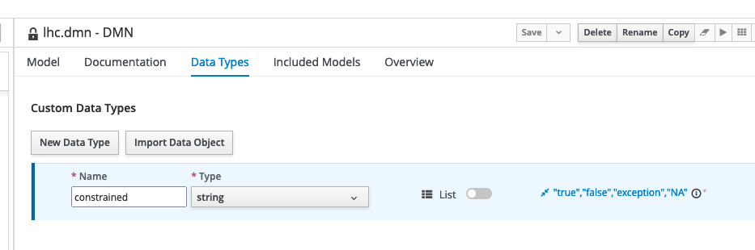
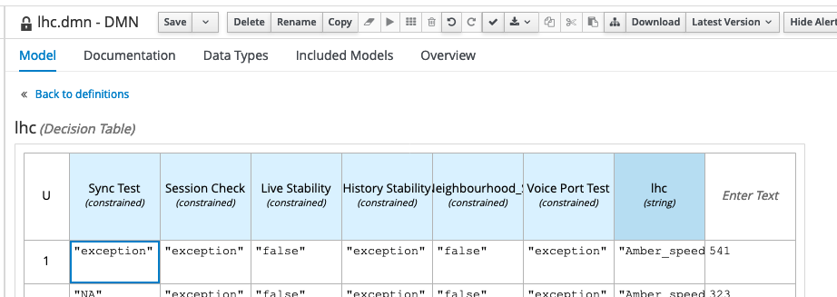
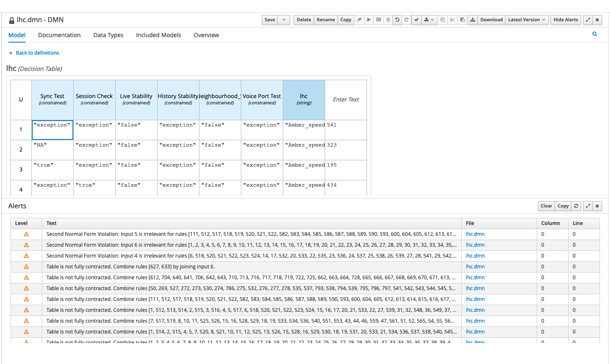
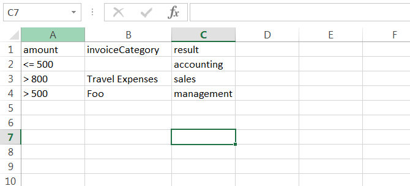
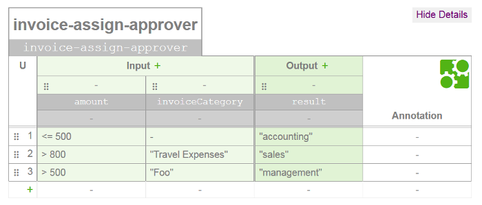
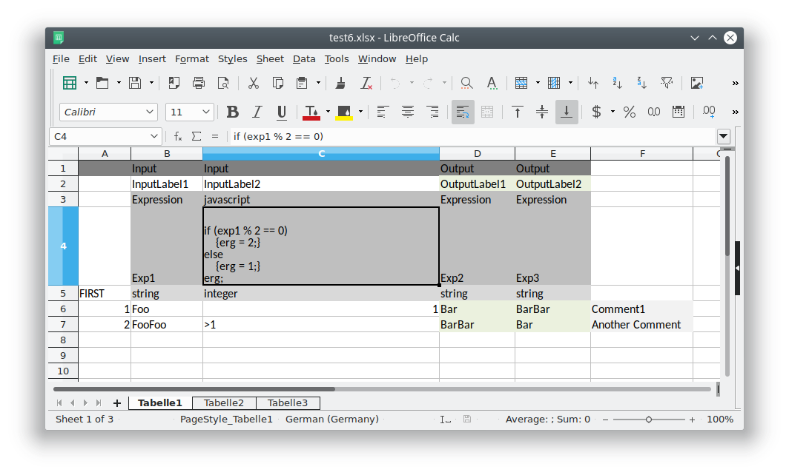

Excel table to DMN decision table converter
===========================================
Documentation for this fork:
---
DMN XLSX

Check out https://git.bskyb.com/lar16/camunda-dmn-xlsx

Add input .xlsx file to `xlsx-dmn-cli/`- I used `lhc.xlsx`, a new xlsx with the rows from the LHC
sheet from the Boomi spreadsheet from the SNS wiki, with some sorting - basically sorted by each
column, from left to right.

- Copy the entire data set and paste (paste values) it into the input xlsx file so that the headings
  are in row 5 and the first column (Seq) is in column A. Replace the 'Seq' heading with the desired
  hit policy - I used `UNIQUE`.
- Move the values from the A column (seq numbers) to after the last column (in my case RAG) - this
  will become an 'annotation/comment' so we can refer back to the xlsx later.
- Copy the headings (not including the hit policy) into rows 2 and 4, this will become the name and
  expression for the inputs and outputs.
- For each column, put either `input` or `output` into the cell in row 1 (again ignoring the seq
  numbers). Put `Expression` in the cell in row 2 for each, and `string` (or another DMN data type,
  possibly `number`) into the cell in row 5 (where the headings were).
- It should look something like .

- From IntelliJ (or using the command line), run the command line converter in advanced
  mode: <run config.png>. Run config is committed to this repo (see .run/). Command line parameters:

  java -jar dmn-xlsx-cli-0.2.0.jar --advanced ./lhc.xlsx ./lhc.dmn

- You may find that Excel converts some of the 'true' and 'false' strings into its stupid built-in
  boolean data type, 'TRUE' or 'FALSE', which will cause an exception like the following:
  java.lang.RuntimeException: cannot parse cell content, unsupported format: cell [D7]
- To resolve this, go to the cell indicated in the exception message and quote the value in the
  cell: replace `FALSE` with `'false` etc (note the single single-quote)
  . 

- You can now import lhc.dmn into your jBPM workspace and, hopefully, it should show up as a
  decision table. You will need to add a DMN Input Data for each input column and link it to the
  decision (this should be doable from the converter app, just haven't quite figured out the correct
  way of doing it in the xml).

- If you want decision analysis to happen, you'll have to add a Data Type with constraints so that
  BC knows what values each column can take. For LHC, this is simple, each column can only take one
  of four values. 
- Then assign that data type to each of the relevant input
  columns: 
- Once saved or validated, business central should tell you ways you can simplify the
  ruleset. 

Upstream documentation:
===
This project has two components:

1. A standalone converter to transform Excel worksheets (xlsx files) into DMN decision tables (dmn
   files), implemented and embeddable in Java.
2. A [Camunda BPM](https://www.camunda.org) process engine plugin to enable xlsx deployment as part
   of process applications. Xlsx files are then converted on the fly to DMN tables.

## Examples

### Simple Mode

See
also: [Camunda Team Blog: Converting Excel Worksheets to DMN](https://blog.camunda.com/post/2016/01/excel-dmn-conversion/)

#### Input: Spreadsheet



#### Output: DMN Decision Table



### Advanced Mode

See
also: [Added support for a new "advanced" detection strategy #8](https://github.com/camunda/camunda-dmn-xlsx/pull/23)

[Example spreadsheet file](https://github.com/camunda/camunda-dmn-xlsx/blob/master/xlsx-dmn-converter/src/test/resources/test6.xlsx)



Features
--------

* Conversion of Excel worksheets to DMN decision tables with inputs, outputs and rules
* Pluggable strategy to determine columns that represent inputs and outputs
* Comes as a Java library that can be embedded into custom applications
* Comes as a command line application to execute standalone
* Comes as a process engine plugin to integrate with process application deployments

Usage
-----

### Standalone Converter

#### Command Line

1. [Download the command line tool](https://artifacts.camunda.com/artifactory/public/org/camunda/bpm/extension/dmn/dmn-xlsx-cli/0.2.0/dmn-xlsx-cli-0.2.0.jar)
   . It is a runnable jar file, so you need to have Java installed.
2. Take an Excel file that contains a decision to convert and place it next to the downloaded jar.
3.
Execute `java -jar dmn-xlsx-cli-0.2.0.jar --inputs A,B,C --outputs D,E,F path/to/input/file.xlsx path/to/output/file.dmn`
. Note that this example assumes the columns A, B, and C are inputs and D, E, F are outputs. You can
set these as you like.
4. Obtain the dmn table and import it in Camunda modeler or in
   the [online DMN table editor](http://demo.bpmn.io/dmn).

#### Java

##### Artifacts

To use the Java library, add the following Maven dependency to your project:

```xml

<dependency>
  <groupId>org.camunda.bpm.extension.dmn</groupId>
  <artifactId>dmn-xlsx-converter</artifactId>
  <version>0.2.0</version>
</dependency>
```

##### Read Excel file, transform to DMN, write to DMN file:

```java
InputStream xlsxInputStream=...; // open xlsx file here

// convert
    XlsxConverter converter=new XlsxConverter();
    DmnModelInstance dmnModelInstance=converter.convert(inputStream);

// write
    OutputStream dmnOutputStream=...; // open outputstream to file here
    Dmn.writeModelToStream(dmnOutputStream,dmnModelInstance);
```

##### Configure conversion

The class `org.camunda.bpm.dmn.xlsx.XlsxConverter` has bean properties that allow configuration of
the conversion process. These are:

* `ioDetectionStrategy`: An instance of `org.camunda.bpm.dmn.xlsx.InputOutputDetectionStrategy`. The
  default strategy assumes that all but the last column of the worksheet are inputs and the last
  column is an output. An instance of `org.camunda.bpm.dmn.xlsx.StaticInputOutputDetectionStrategy`
  can be set to define a static set of input and output columns. Custom strategies can be
  implemented by implementing the interface `InputOutputDetectionStrategy`.

### Camunda BPM process engine plugin

#### Artifacts

The process engine artifact can be obtained via the following Maven coordinates:

```xml

<dependency>
  <groupId>org.camunda.bpm.extension.dmn</groupId>
  <artifactId>dmn-xlsx-process-engine-plugin</artifactId>
  <version>0.2.0</version>
</dependency>
```

#### Configuration

Make sure to make the resulting `org.camunda.bpm.dmn:dmn-xlsx-process-engine-plugin` artifact
available on the process engine's classpath. Then configure the
class `org.camunda.bpm.xlsx.plugin.XlsxDmnProcessEnginePlugin` as a process engine plugin.

#### Usage

With the plugin in place, xlsx files can be included in a deployment and are automatically
recognized and converted into DMN XML at deployment time. To configure conversion for a
file `<name>.xlsx`, a file `<name>.xlsx.yaml` can be included in the deployment. Example yaml
contents:

```yaml
---
inputs: [ 'A', 'B' ]
outputs: [ 'C', 'E' ]
```

This declares that the columns A and B are inputs of the decision and C and E are outputs.


License
-------

Apache License 2.0.

How to contribute
-----------------

Contributions are welcome at any time. Use github issues to discuss missing features or report bugs,
and pull requests to contribute code.
